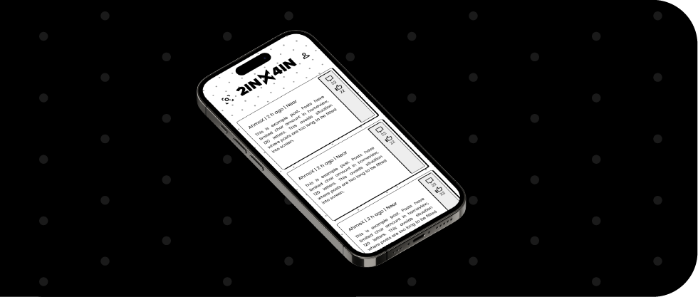

<link rel="stylesheet" href="https://use.typekit.net/msx0obd.css">
<link rel="stylesheet" href="https://cdnjs.cloudflare.com/ajax/libs/font-awesome/4.7.0/css/font-awesome.min.css">
<link rel="stylesheet" href="styles.css">

  

<!--

-->
<!--

  
  
  -->

  
  <!--
  
  
  -->
  
  <!--
  -->
  

<!--

-->

  

  

  

  

  

  
  

  
  

  
  

  
  

  

